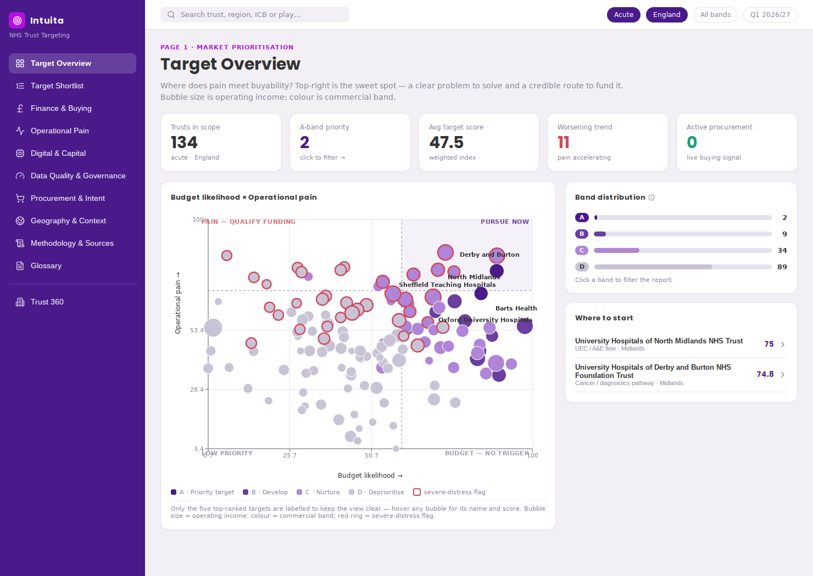
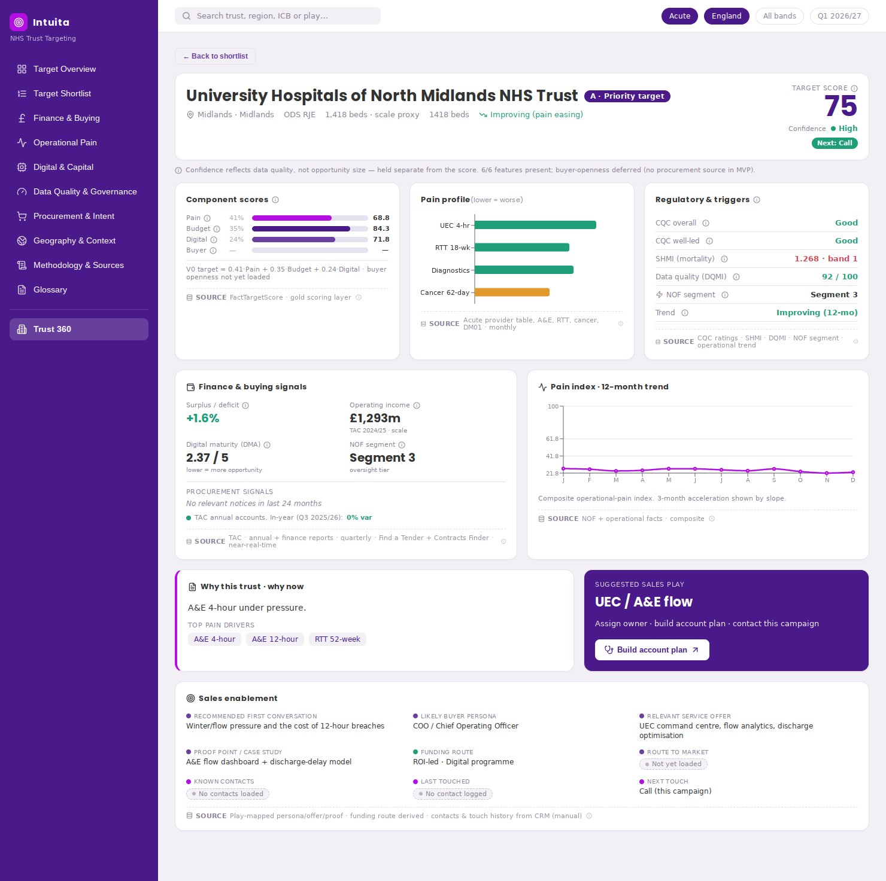
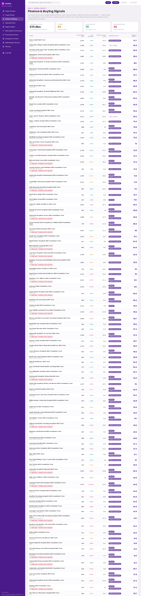
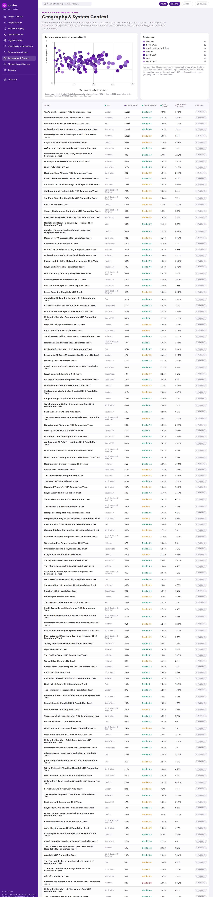
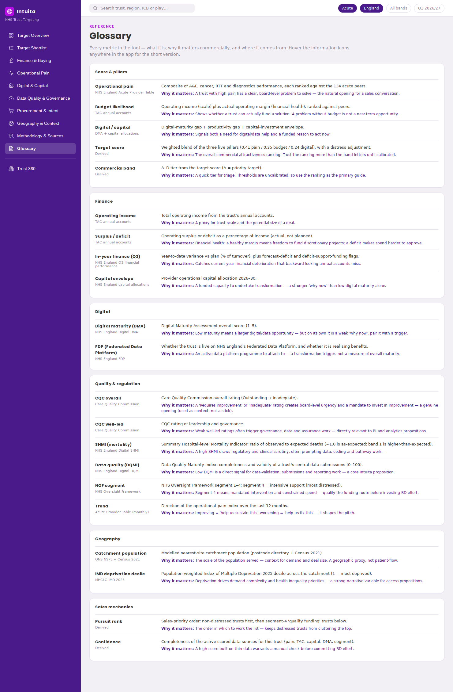

# NHS Acute-Trust Sales-Targeting Tool

A commercial prioritisation tool that ranks England's **134 acute NHS trusts** by how
attractive they are to approach now — combining where each trust has the most **operational
pain**, the **budget likelihood** to fund a solution, and **digital / transformation**
signals — so a sales team can focus effort where money, urgency and change overlap.

> **This is a commercial prioritisation index, _not_ an NHS performance or quality rating.**
> A high score means a strong commercial opportunity (a clear problem + a credible route to
> fund it), not that a hospital is "good" or "bad". Trusts in formal distress are deliberately
> held back from the top band and flagged "qualify funding first".



---

## Contents

| Section | |
|---|---|
| [What it is](#what-it-is) | the product in one screen |
| [The interactive prototype](#the-interactive-prototype) | how to view / run the app |
| [Methodology](#methodology-summary) | how the score is built |
| [Data sources](#data-sources) | what's used and where it comes from |
| [Repository structure](#repository-structure) | what's in this repo |
| [Reproducing the outputs](#reproducing-the-outputs) | the pipeline commands |
| [Documentation](#documentation) | the full doc set |
| [Known limitations](#known-limitations) | read before relying on it |
| [Data & licensing](#data--licensing) | attribution |

---

## What it is

A ten-plus-page interactive prototype backed by a reproducible Python pipeline that turns
public NHS and ONS data into a scored, rankable target list. Every trust gets a target score,
a commercial band (A–D), three pillar scores, a distress-adjusted pursuit rank, a confidence
level, and a rich Trust 360 profile (finance, operational pain, digital/capital, regulatory,
catchment). Key metrics carry hover **info-tooltips** explaining why each matters commercially,
and a **Glossary** page documents every term.

**At a glance:** 134 acute trusts · 3 live scoring pillars (a 4th, buyer openness, is planned)
· evidence layer of CQC, SHMI, DQMI, FDP and a modelled population catchment · all from public
sources.

## The interactive prototype

`src/components/NhsTargetingPrototype.jsx` is a **single-file React component**. The processed
data is inlined in the file, so it runs with no backend.

- **Stack:** React + Vite, [`recharts`](https://recharts.org) for charts, and
  [`lucide-react`](https://lucide.dev) for icons.
- **Local app:** this repo already contains the Vite wrapper used for GitHub Pages.

```bash
npm install
npm run dev
```

The production build is emitted to `dist`:

```bash
npm run build
```

GitHub Pages deployment is handled by `.github/workflows/static.yml`. Configure the repository
Pages source to **GitHub Actions**, then pushes to `main` will publish the tracker.

The `screenshots/` folder shows every page rendered on the real data, so the app can be
reviewed without building it.

## Methodology (summary)

Every metric is converted to a **percentile rank within the 134 acute peers** (0–100),
oriented so higher always means a stronger commercial signal. Pillars are the mean of their
features; the live **V0** target is their re-normalised weighted sum:

```
Target (V0) = 0.41 · Operational pain  +  0.35 · Budget likelihood  +  0.24 · Digital / capital
              − severe-distress adjustment
```

| Pillar | Weight | Built from |
|---|---|---|
| Operational pain | 0.41 | A&E 4hr/12hr, cancer 62-day/FDS, diagnostics >6wk, RTT 52/18-wk |
| Budget likelihood | 0.35 | operating income (scale) + actual operating margin (health) |
| Digital / capital | 0.24 | digital-maturity gap + productivity gap + capital-envelope trigger |
| *Buyer openness* | *planned* | *no procurement source yet — weight re-normalised away in V0* |

These are the original **Model A** weights (Pain .35 / Budget .30 / Digital .20 / Buyer .15)
re-normalised after dropping buyer openness; the four-pillar version is the **target V1**.
Trusts in NHS Oversight Framework **segment 4** take a distress penalty and are capped at
Band C. **Confidence is scored separately** from the target, so weak data can never inflate a
ranking. Full detail, worked examples and an independent verification are in
[`METHODOLOGY.md`](METHODOLOGY.md) and [`WORKED_EXAMPLES_AND_SOURCES.md`](WORKED_EXAMPLES_AND_SOURCES.md).

## Data sources

All data is public. "Scored" sources drive the target; "evidence" sources are shown on the
pages but do not change the score.

| Status | Source | Publisher |
|---|---|---|
| **Scored** | NHS Oversight Framework (universe, finance, productivity, distress) | NHS England |
| **Scored** | Acute Provider Table (operational pain) | NHS England |
| **Scored** | TAC annual accounts (operating income + margin) | NHS England |
| **Scored** | Provider capital allocations 2026–30 | NHS England |
| **Scored** | Digital Maturity Assessment | NHS England Digital |
| **Evidence** | CQC ratings (Overall + Well-led) | Care Quality Commission |
| **Evidence** | SHMI (mortality), DQMI (data quality) | NHS England Digital |
| **Evidence** | Federated Data Platform (live + benefits) | NHS England |
| **Evidence** | In-year finance (Q3 variance, forecast, DSF) | NHS England |
| **Catchment** | ODS sites + NSPL + Census 2021 + IMD 2025 | NHS England Digital / ONS / MHCLG |
| **Planned** | Procurement (Find a Tender / Contracts Finder / CRM) | Cabinet Office |

See [`WORKED_EXAMPLES_AND_SOURCES.md`](WORKED_EXAMPLES_AND_SOURCES.md) for the full provenance
table and [`REVIEW_RESPONSE_v2.md`](REVIEW_RESPONSE_v2.md) for sources reviewed but not used
(NHP, ERIC, Discharge) and why.

## Repository structure

```
.
├── README.md                       ← you are here
├── METHODOLOGY.md                  ← full scoring methodology (authoritative)
├── WORKED_EXAMPLES_AND_SOURCES.md  ← source provenance + worked examples + verification
├── TARGET_EXAMPLES.md              ← three data-driven example targets and why
├── EXTENSION_ROADMAP.md            ← prioritised extensions and their rationale
├── REVIEW_RESPONSE_v2.md           ← point-by-point response to external review
│
├── src/components/NhsTargetingPrototype.jsx
│                                      ← the interactive app (single-file React)
├── screenshots/                    ← all 11 pages rendered on real data
│
├── sales_scorecard.csv             ← GOLD OUTPUT: 134 trusts scored
├── feature_table.csv               ← raw inputs behind every score (audit)
├── catchment_bridge.csv            ← 33,755 LSOA→trust assignments
├── catchment_summary.csv           ← per-trust population / age / ethnicity / IMD
├── cqc_ratings_extracted.csv       ← trust-level CQC Overall + Well-led
├── fdp_live_organisations_extracted.csv  ← FDP live + benefits flags
├── procurement_watchlist_TEMPLATE.csv    ← drop-in template to activate buyer openness
│
├── nhs_targeting_transform/        ← scoring pipeline (the core logic)
│   ├── config.py                   ← weights + feature definitions
│   ├── loaders.py                  ← per-source readers
│   ├── scoring.py                  ← percentile pillars, distress, bands, confidence
│   ├── build.py                    ← orchestration + CLI → sales_scorecard.csv
│   ├── catchment.py                ← NSPL + sites + Census → catchment bridge
│   ├── cqc_extract.py              ← streams the 1 GB CQC ODS → ratings CSV
│   └── requirements.txt
└── nhs_targeting_ingest/           ← bronze source discovery / fetch
```

## Reproducing the outputs

```bash
pip install pandas openpyxl scipy odfpy

# 1) Scoring pipeline → sales_scorecard.csv + feature_table.csv
python -m nhs_targeting_transform.build --input <dir-of-source-extracts> --out ./gold

# 2) Catchment bridge (needs NSPL + ODS sites + Census + IMD)
python -m nhs_targeting_transform.catchment \
    --nspl NSPL_MAY_2025_UK.zip --sites nhs-trust_sites.csv \
    --census <dir-with-census-lsoa-csvs> --input <dir-with-NOF> --out ./gold

# 3) CQC ratings (one-off; streams the ~1 GB ratings ODS to a small CSV)
python -m nhs_targeting_transform.cqc_extract --ods cqc_ratings.ods --out ./gold
```

Loaders locate each file by glob pattern, so exact filenames don't matter as long as the files
are present. Source data is **not** committed to this repo (size + licensing — see below);
point `--input` at your own copy of the extracts.

## Documentation

| Document | What's in it |
|---|---|
| [`METHODOLOGY.md`](METHODOLOGY.md) | the scoring model, weights, distress, confidence, catchment, every design decision |
| [`WORKED_EXAMPLES_AND_SOURCES.md`](WORKED_EXAMPLES_AND_SOURCES.md) | full source provenance, two number-by-number worked traces, independent verification |
| [`TARGET_EXAMPLES.md`](TARGET_EXAMPLES.md) | three example targets with data-driven rationale |
| [`EXTENSION_ROADMAP.md`](EXTENSION_ROADMAP.md) | where to take it next, in value-for-effort order |
| [`REVIEW_RESPONSE_v2.md`](REVIEW_RESPONSE_v2.md) | response to external review; status of every source |
| [`INTERACTION_MODEL.md`](INTERACTION_MODEL.md) | build spec for in-app methodology tooltips + cross-filter/drilldown |

In-app, the **Glossary** page and the hover info-tooltips on each metric document terms for
non-specialist readers.

## Screenshots

| | |
|---|---|
|  |  |
| Trust 360 — full profile with metric tooltips | Finance & buying signals |
|  |  |
| Geography — catchment + IMD deprivation | Glossary — every metric explained |

## Known limitations

1. **Bands are uncalibrated.** Percentile pillars centre the target near ~48, so the A/B/C/D
   cut-offs are deliberately tight. **Trust the ranking, not the band letters**, until
   calibrated against CRM win/loss history.
2. **Buyer openness is not in the score** (no procurement source yet). The score answers "is
   this an interesting opportunity?" better than "is this actionable now?".
3. **Evidence vs scored.** CQC, SHMI, DQMI, FDP, Q3 finance and catchment are shown but not in
   the score, to keep rankings stable pre-calibration.
4. **Catchment is a geographic proxy**, not patient-flow; it understates specialist trusts.
5. **Large-trust bias:** the score correlates with operating income (bigger trusts → bigger
   potential deals); pair with a per-capita view where intensity matters.

The [roadmap](EXTENSION_ROADMAP.md) addresses each of these.

## Data & licensing

The processed outputs derive from public data published under the **Open Government Licence
v3.0** (NHS England, NHS England Digital, ONS, Care Quality Commission, MHCLG) — attribute
accordingly if you redistribute. Census 2021 data © ONS. IMD 2025 © MHCLG. CQC ratings © Care
Quality Commission. Raw source files are **not** committed here; only derived/processed
extracts and code are. Add a `LICENSE` file for your own code before making the repo public.

---

*Built for Intuita. A commercial account-prioritisation prototype on real public NHS & ONS
data — not an official NHS performance rating.*
